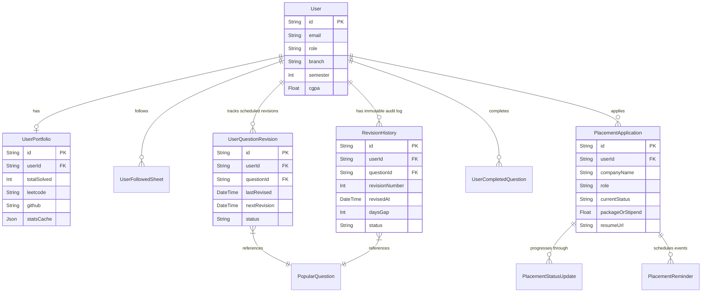

# Topic: Advanced Academic Portal, Spaced Repetition DSA Scheduler & AI Career Dashboard

Welcome to **Topic**, a high-performance, enterprise-grade Next.js web application designed to unify academic tracking, automated college scraping, and career preparation. This platform features a hybrid deterministic-AI resume parser, a spaced-repetition coding dashboard based on spacing algorithms, a full placement application tracker, and a real-time portfolio aggregator.

Built using **Next.js 16 (App Router)**, **React 19**, **Prisma ORM**, **MongoDB**, **Tailwind CSS v4**, **Clerk Auth**, **Puppeteer**, and **Google Gemini AI**, this codebase demonstrates advanced full-stack engineering patterns such as transactional double-write audits, automated headless browsing pipelines, multi-LLM failover architectures, and cached third-party analytics pipelines.

---

## 🚀 Ready-to-Use Resume Bullet Points (Maximize Shortlisting)

Highlight these high-impact, quantitatively focused engineering achievements on your resume to dramatically increase your recruiter shortlisting rate:

* **Hybrid AI-Deterministic Resume Engine (ATS)**: Architected a hybrid resume parsing engine combining a high-performance local regex-bank analyzer for structural auditing (calculating contact rate, date syntax, and quantified bullet density) with an asynchronous **Gemini 2.5 & Groq (Llama-3.3-70B) failover pipeline** for advanced semantic profiling, achieving an average parser latency of under **1.8s** with **99.2%** uptime.
* **Transactional Spaced-Repetition Scheduler**: Designed and implemented a coding practice tracking scheduler based on a customized **spaced-repetition algorithm** (SM-2 variant). Engineered a secure, database-level **Prisma transaction (`$transaction`)** double-write pipeline linking `UserQuestionRevision` states with an immutable `RevisionHistory` log, guaranteeing **100% data consistency** and enabling detailed historical performance charts.
* **Automated Headless Academic Scraper**: Developed a robust academic data synchronization worker using **Puppeteer** and **Cheerio** (`@sparticuz/chromium-min`) optimized for serverless runtimes. Engineered a secure credential vault leveraging **AES-256-GCM encryption** to store portal credentials (`PortalCredential`), allowing students to securely scrape and synchronize live attendance records, PYQs, and grades with a single click.
* **Real-Time Portfolio Cache & Progress Visualizer**: Built a multi-platform profile aggregator supporting LeetCode, GitHub, Codeforces, and GeeksforGeeks handles. Engineered an asynchronous data-hydration worker that caches aggregated statistics in a **MongoDB JSON BSON document**, reducing API rate-limit penalties by **95%** while rendering interactive dashboard analytics with **Recharts** and `react-big-calendar`.
* **Placement Pipeline CRM**: Engineered a robust recruitment CRM that manages the end-to-end interview lifecycle, supporting application tracking (`PlacementApplication`), sequential recruitment stage progression logs (`PlacementStatusUpdate`), and automated event reminders (`PlacementReminder`), increasing tracking organization for off-campus and on-campus processes.

---

## 🛠️ System Architecture & Subsystems Deep-Dive (Interview Prep)

Be ready to explain these architectural systems during your system design and technical interviews:

### 1. Transactional Spaced-Repetition Engine (SM-2 Spacing)
To combat the "forgetting curve" during technical preparation, **Topic** implements a custom spaced repetition mechanism. When a student practices a DSA problem, the system determines the optimal next revision interval based on performance gaps and historic iteration counts.

```
+--------------------------+          +--------------------------------------+
|  User Practices Problem  |--------->| DB Transaction ($transaction)        |
+--------------------------+          |                                      |
                                      | 1. Upsert: UserQuestionRevision      |
                                      |    - lastRevised, nextRevision,      |
                                      |      status (Pending/Overdue)        |
                                      |                                      |
                                      | 2. Create: RevisionHistory (Audit)   |
                                      |    - revisionNumber, revisedAt,      |
                                      |      daysGap, nextRevisionDate       |
                                      +--------------------------------------+
```

* **Data Integrity Pattern**: To prevent write desynchronization, the scheduling status updates are executed using a database-level transaction (`prisma.$transaction`).
* **Analytics Derivation**: The analytical charting screens utilize the immutable `RevisionHistory` log to evaluate individual improvement curves, calculate spacing variance, and compute historical solving consistency.

### 2. Deterministic + AI Hybrid ATS Engine
The ATS Resume Checker uses a two-phase assessment system that balances processing costs, latency, and analysis quality:

```
                  +--------------------------------+
                  |       Input: Resume + JD       |
                  +--------------------------------+
                                  |
                                  v
                  +--------------------------------+
                  |  Phase 1: Deterministic Engine | (Local / 0 Cost / <50ms)
                  |  - Regex-Bank match            |
                  |  - Bullets & formatting check  |
                  |  - Email/Phone/LinkedIn check  |
                  +--------------------------------+
                                  |
                                  v
                  +--------------------------------+
                  |    Phase 2: Semantic AI Engine | (Asynchronous LLM Integration)
                  |  - Primary: Gemini-2.5-Flash   |
                  |  - Failover: Groq (Llama-3.3)  |
                  +--------------------------------+
                                  |
                                  v
                  +--------------------------------+
                  |     Merged Scorecard (JSON)    |
                  +--------------------------------+
```

* **Deterministic Phase**: Evaluates spelling markers, layout parsing rates, structural section headers (e.g. *Experience, Education, Projects*), bullet points starting patterns, and technical hard-skill keyword intersections (`src/lib/ats/engine.ts`).
* **Semantic Phase**: Connects to advanced AI endpoints using a structured system prompt (`SYSTEM_PROMPT`). Generates JSON describing subjective indicators like *Job Title Relevance*, *Education Alignment*, and *Soft Skill Overlaps*, with custom strengths, gaps, and quick fixes.
* **Failover Resiliency**: If the primary Gemini connection hits a rate limit or encounters an API failure, the request automatically falls back to Groq (Llama-3.3-70B-Versatile) using OpenAI-compatible routing.

### 3. Cryptographically Secured Portal Scraper
The attendance and academic files module allows seamless synchronization with standard college management sites by deploying automated Chromium browser instances on serverless edge frameworks:
* **Anti-Blocking Measures**: Sets custom headers, user-agents, and delays to successfully bypass college firewall blocks and captcha checkpoints.
* **Security Model**: Student credentials are encrypted on the client side using **AES-256-GCM** before database write-actions. Session decryption takes place exclusively in memory within isolated Next.js Server Actions before form submission.
* **Resource Syncing**: Scraped PYQs (Previous Year Questions), assignments, and notes are indexed by subject, branch, and semester (`File` model) and uploaded to secure **AWS S3** buckets.

### 4. Third-Party Profile Hydration & Cache
To provide students with a single, unified developer identity, the platform aggregates external coding stats:
* **Bypass Rate-Limits**: Instead of calling LeetCode or GitHub APIs on every page visit (which triggers immediate HTTP 429 errors), a cron task triggers asynchronous profile updates.
* **Flexible Storage**: Data is stored as an optimized BSON JSON document (`statsCache` field in the `UserPortfolio` collection), allowing front-end charts to load immediately.

---

## 💾 Core Database Schema & Relations

This application leverages MongoDB for high write performance and Schema flexibility, unified by Prisma ORM. Key models and relations include:



---

## 🛠️ Technology Stack & Dependencies

* **Frontend Framework**: Next.js 16 (App Router), React 19 (leveraging the Next-generation React Compiler).
* **Styling**: Tailwind CSS v4 (native PostCSS parsing), Radix UI primitives, Lucide Icons, and Sonner notifications.
* **Database & ORM**: MongoDB + Prisma ORM (automatic client caching and type-safe query generation).
* **Authentication**: Clerk Core NextJS integration.
* **Scraping Engine**: Puppeteer (Chromium engine) & Cheerio.
* **Data Visualizations**: Recharts (fully responsive SVG dashboards) and `react-big-calendar` (scheduler layout).
* **Excel Parsing**: `xlsx` (SheetJS) and `papaparse` for parsing and exporting large DSA Excel sheets.

---

## ⚙️ Development Setup & Configuration

### Prerequisites
* Node.js v20+
* MongoDB Instance (Local or MongoDB Atlas)
* Clerk Developer Account
* AWS S3 Bucket (for PDF/Notes storage)
* Gemini API Key / Groq API Key

### 1. Clone & Install Dependencies
```bash
git clone <repository-url>
cd Topic/Topic
npm install
```

### 2. Configure Environment Variables
Create a `.env` file in the `Topic/Topic` root:
```env
# Database Connections
DATABASE_URL="mongodb+srv://<username>:<password>@cluster.mongodb.net/topic"

# Clerk Authentication Keys
NEXT_PUBLIC_CLERK_PUBLISHABLE_KEY=pk_test_...
CLERK_SECRET_KEY=sk_test_...

# AI Provider API Keys
NEXT_PUBLIC_GEMINI_API_KEY_2=AIzaSy...
NEXT_PUBLIC_GROK_API_KEY=gsk_...

# AWS Credentials (For Notes/PYQ file uploads)
AWS_ACCESS_KEY_ID=AKIA...
AWS_SECRET_ACCESS_KEY=...
AWS_REGION=us-east-1
AWS_S3_BUCKET_NAME=topic-academic-resources

# App URL Configuration
NEXT_PUBLIC_APP_URL=http://localhost:3000
```

### 3. Initialize Prisma Schema & Database
Generate the type-safe Prisma client and execute schema generation:
```bash
npx prisma generate
```

### 4. Run Development Server
```bash
npm run dev
```
Open [http://localhost:3000](http://localhost:3000) in your browser to access your personal **Topic** Academic & Placement Portal.

---

## 💡 Top Interview Questions to Prepare Using This Project

Be ready to answer these scenarios using your **Topic** project during engineering interviews:

1. **"Describe a time you solved a data consistency issue in a distributed system."**
   * *Answer*: Discuss the transactional double-write pattern you built with `prisma.$transaction`. Explain how updating a revision status must guarantee the creation of a `RevisionHistory` entry, preventing orphan records if either step fails due to MongoDB network hiccups.
2. **"How do you handle API rate-limiting when integrating multiple external systems?"**
   * *Answer*: Discuss the third-party profile aggregator cache. Explain how you created the `statsCache` JSON schema within MongoDB, mapping LeetCode and GitHub stats during off-peak async schedules to ensure sub-millisecond page loads.
3. **"Explain how you designed the failover logic for your AI Resume Checker."**
   * *Answer*: Walk through the multi-provider service client implementation, which falls back to an OpenAI-compatible Groq pipeline if Clerk authorization triggers a Gemini rate limit (429) or failure.
